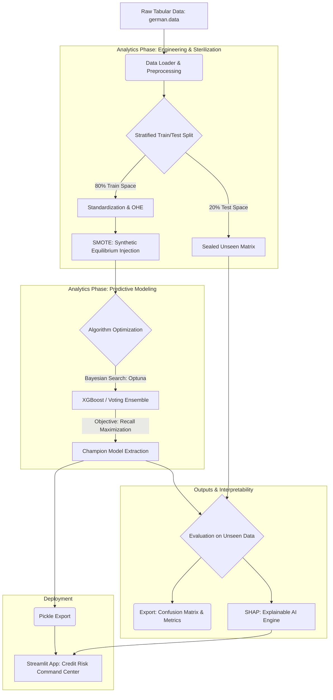

<h1 align="center">Enterprise Credit Risk Command Center: Predictive Scoring & XAI Architecture</h1>

<p align="center">
  
  
</p>

<p align="center">
  
  
  
  
  
  
</p>


---

## Daftar Isi

1. [Ringkasan Eksekutif](#1-ringkasan-eksekutif)
2. [Pemetaan Kompetensi SKKNI](#2-pemetaan-kompetensi-skkni)
3. [Eksplorasi & Persiapan Data](#3-eksplorasi--persiapan-data)
4. [Pemodelan & Evaluasi](#4-pemodelan--evaluasi)
5. [Explainable AI (XAI)](#5-explainable-ai-xai)
6. [Arsitektur Sistem (CRISP-DM)](#6-arsitektur-sistem-crisp-dm)
7. [Dashboard Deployment](#7-dashboard-deployment)
8. [Struktur Repositori](#8-struktur-repositori)
9. [Cara Menjalankan](#9-cara-menjalankan)
10. [Tentang Penulis](#tentang-penulis)

---

## 1. Ringkasan Eksekutif

Repositori ini membangun arsitektur Machine Learning end-to-end untuk memitigasi **Non-Performing Loans (NPL)** di sektor keuangan. Proyek ini melampaui paradigma black-box konvensional dengan menghadirkan **Decision Support System** yang:

- Menggunakan **Voting Ensemble** berbasis XGBoost yang dioptimasi secara probabilistik
- Terintegrasi dengan framework **Explainable AI (XAI)** berbasis SHAP
- Mengikuti metodologi **CRISP-DM** secara ketat

Tujuan utamanya adalah menyeimbangkan antara mitigasi risiko kredit dan penjagaan profitabilitas perbankan.

---

## 2. Pemetaan Kompetensi SKKNI

Repositori ini memenuhi **11 Unit Kompetensi (KUK)** sesuai Standar Kompetensi Kerja Nasional Indonesia (SKKNI) untuk Sertifikasi Data Scientist berdasarkan **Kepmenaker No. 299 Tahun 2020**.

| Kode Unit | Unit Kompetensi | Bukti Implementasi |
| :--- | :--- | :--- |
| `J.62DMI00.001.1` | Menentukan Objektif Bisnis | `docs/BUSINESS_REQUIREMENT.md` |
| `J.62DMI00.002.1` | Menentukan Tujuan Teknis Data Science | `docs/BUSINESS_REQUIREMENT.md` |
| `J.62DMI00.005.1` | Menelaah Data | Notebook 01 (EDA) & `docs/DATA_DICTIONARY.md` |
| `J.62DMI00.006.1` | Memvalidasi Data | Notebook 01 (Topological & Anomaly Validation) |
| `J.62DMI00.007.1` | Menentukan Objek Data | `src/feature_engineering.py` |
| `J.62DMI00.008.1` | Membersihkan Data | Notebook 02 & `src/data_pipeline.py` |
| `J.62DMI00.009.1` | Mengkonstruksi Data | Notebook 02 (Z-Score, OHE, SMOTE) |
| `J.62DMI00.012.1` | Membangun Skenario Model | Notebook 03 (Stratified Cross-Validation) |
| `J.62DMI00.013.1` | Membangun Model | Notebook 03 (Bayesian Optuna & Voting Ensemble) |
| `J.62DMI00.014.1` | Mengevaluasi Hasil Pemodelan | Notebook 03 (Blind Test, ROC-AUC, F1-Score) |
| `J.62DMI00.015.1` | Melakukan Proses Review Pemodelan | Notebook 04 (XAI/SHAP) & `docs/MODEL_CARD.md` |

---

## 3. Eksplorasi & Persiapan Data

### 3.1 Deteksi Imbalance & Anomali Struktural


**Temuan:** Dataset menunjukkan bias makroskopis dengan rasio **70:30** (Good Risk vs Bad Risk). Melatih model pada distribusi mentah ini memicu *accuracy paradox* — model menjadi buta terhadap kelas minoritas yang justru paling kritis.

**Intervensi Engineering:**

- **Geometric Scaling** — Z-Score Standardization (`StandardScaler`) untuk menekan magnitudo outlier tanpa menghilangkan variansinya.
- **Zero Leakage Protocol** — Stratified Split 80/20 diterapkan *sebelum* intervensi sintetis apapun.
- **Synthetic Equilibrium** — SMOTE diinjeksikan eksklusif ke training set untuk mencapai keseimbangan 50:50.

| Status Matrix | Good Risk (0) | Bad Risk (1) | Rasio | Kondisi |
| :--- | :---: | :---: | :---: | :--- |
| Raw Training Matrix | 560 | 240 | 70:30 | Imbalanced |
| SMOTE Applied Matrix | 560 | 560 | 50:50 | **Balanced** |
| Sealed Blind Test Matrix | 140 | 60 | 70:30 | Zero Leakage ✓ |

### 3.2 Analisis Separasi Bivariat


**Temuan:** Distribusi scatter menunjukkan *overlap* multidimensi yang sangat non-linier antar kelas risiko. Ini secara empiris menggugurkan penggunaan classifier linier sederhana dan memvalidasi perlunya arsitektur gradient-boosted tree.

---

## 4. Pemodelan & Evaluasi

### 4.1 Kalibrasi Hyperparameter Bayesian

Menggunakan framework **Optuna**, arsitektur XGBoost dioptimasi melalui Bayesian Search. Fungsi objektifnya didefinisikan untuk memaksimalkan **Recall** kelas minoritas — memprioritaskan deteksi kredit bermasalah di atas akurasi global superfisial.

### 4.2 Evaluasi Blind Test (200 Observasi Unseen)


Hasil validasi model pada sealed test matrix:

| Metrik | Nilai | Interpretasi |
| :--- | :---: | :--- |
| **ROC-AUC** | 0.77 | Batas probabilistik stabil di berbagai threshold |
| **Recall (Bad Risk)** | 57% | 34 dari 60 kasus default berhasil terdeteksi |
| **F1-Score** | 0.60 | Keseimbangan optimal: filter kredit beracun tanpa menolak aplikasi sehat |

$$F_1 = 2 \times \frac{\text{Precision} \times \text{Recall}}{\text{Precision} + \text{Recall}}$$

---

## 5. Explainable AI (XAI)

Untuk memenuhi kepatuhan tata kelola perusahaan dan regulasi (audit OJK), sifat black-box ensemble didekonstruksi menggunakan **SHAP** (SHapley Additive exPlanations).

### 5.1 Audit Makro — Global Feature Attribution


SHAP Summary Plot mengidentifikasi tiga driver statistik utama:

1. **`checking_account_status`** — Korelasi negatif definitif; ketiadaan dana rekening giro meningkatkan probabilitas default secara eksponensial.
2. **`duration_months`** — Korelasi positif; horizon pelunasan yang lebih panjang secara sistematis meningkatkan eksposur risiko.
3. **`credit_amount`** — Distribusi modal yang lebih tinggi menginduksi tekanan finansial lebih besar pada pemohon.

### 5.2 Audit Mikro — Dekonstruksi Keputusan Individual


Force/Waterfall Plot berfungsi sebagai *analytical X-Ray* untuk prediksi individual. Pada audit **"Nasabah #3"**, arsitektur menerjemahkan jalur decision-tree kompleks menjadi satu vektor matematika yang dapat dijelaskan — memberikan dasar penolakan yang transparan dan dapat dipertanggungjawabkan secara hukum.

---

## 6. Arsitektur Sistem (CRISP-DM)



---

## 7. Dashboard Deployment


Model yang telah diserialisasi (`champion_xgboost.pkl`) di-deploy melalui antarmuka **Streamlit** yang dinamis.

**Fitur Utama:**
- Credit Analyst dapat menginput data pemohon dan mendapatkan probabilitas risiko secara instan.
- Implementasi *Monkey Patching* dinamis untuk menyelesaikan inkompatibilitas JSON parsing antara XGBoost 2.x dan SHAP TreeExplainer, memastikan rendering Force Plot berbasis JavaScript yang stabil tanpa memory segmentation fault.

---

## 8. Struktur Repositori

```
Credit-Risk-Scoring/
├── dashboard/
│   ├── app.py
│   └── assets/
│       └── custom.css
├── data/
│   ├── processed/          # Sterilized matrices (Z-Score, SMOTE)
│   └── raw/                # Immutable origin datasets
├── docs/
│   ├── BUSINESS_REQUIREMENT.md
│   ├── DATA_DICTIONARY.md
│   ├── MODEL_CARD.md
│   ├── SYSTEM_ARCHITECTURE.md
│   └── USER_MANUAL.md
├── models/                 # Serialized artifacts (.pkl)
├── notebooks/
│   ├── 01_business_understanding_and_eda.ipynb
│   ├── 02_data_preparation_and_smote.ipynb
│   ├── 03_modeling_and_evaluation.ipynb
│   ├── 04_model_interpretability_xai.ipynb
│   └── audit_nasabah_3.png
├── src/
│   ├── data_pipeline.py
│   ├── feature_engineering.py
│   ├── modeling.py
│   ├── Img/
│   └── sql/
├── README.md
├── requirements.txt
└── CHANGELOG.md
```

---

## 9. Cara Menjalankan

**1. Clone repositori:**
```bash
git clone https://github.com/RazerArdi/credit-risk-scoring.git
cd credit-risk-scoring
```

**2. Instalasi dependensi:**
> Disarankan menggunakan virtual environment (`conda` atau `venv`).
```bash
pip install -r requirements.txt
```

**3. Jalankan dashboard:**
```bash
streamlit run dashboard/app.py
```

---

## Tentang Penulis

**Bayu Ardiyansyah** — Data Scientist & Machine Learning Engineer

Afiliasi akademik di Informatika dan Riset Data Science, Universitas Muhammadiyah Malang (UMM).

[](https://www.linkedin.com/in/byardi1/)
[](https://github.com/RazerArdi)

---

> **Disclaimer:** Repositori ini dipublikasikan sebagai portofolio komprehensif untuk Sertifikasi Data Scientist BNSP. Arsitektur ini mendemonstrasikan data engineering tingkat enterprise, pemodelan prediktif, dan kerangka kepatuhan regulasi.