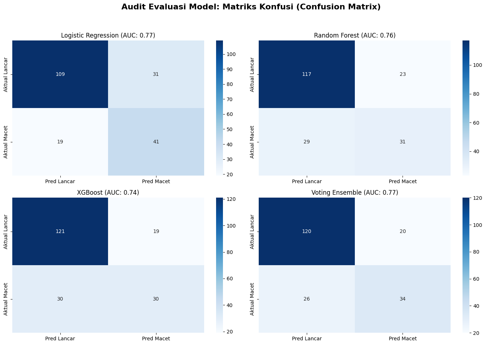
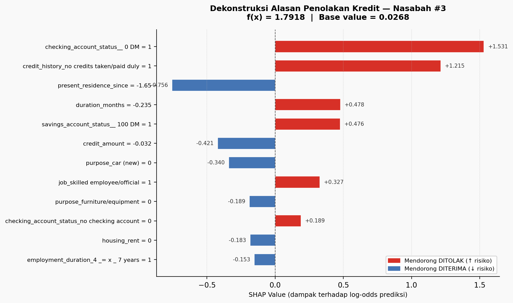
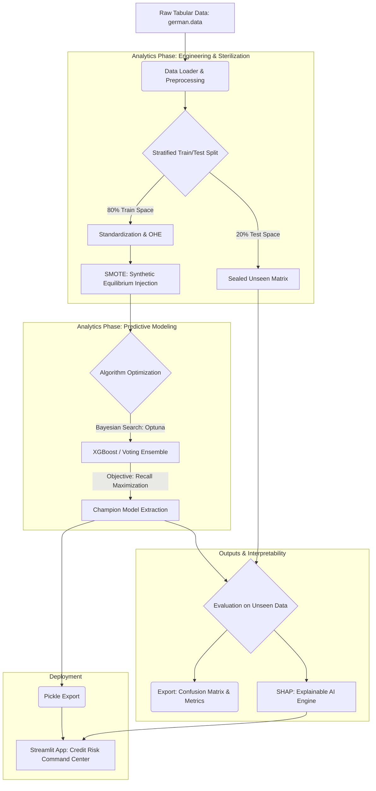

<h1 align="center">Credit Risk Center: Predictive Scoring & XAI Architecture</h1>

<p align="center">
  
  
</p>

<p align="center">
  
  
  
  
  
  
</p>

## Table of Contents

1. [Executive Synopsis](#1-executive-synopsis)
2. [Regulatory Compliance & Competency Mapping (SKKNI)](#2-regulatory-compliance--competency-mapping-skkni)
3. [Epistemological Validation & Data Topography](#3-epistemological-validation--data-topography-notebooks-01--02)
4. [Algorithmic Optimization & Predictive Efficacy](#4-algorithmic-optimization--predictive-efficacy-notebook-03)
5. [Algorithmic Transparency & Model Agnosticism](#5-algorithmic-transparency--model-agnosticism-notebook-04---xai)
6. [System Architecture (CRISP-DM Topology)](#6-system-architecture-crisp-dm-topology)
7. [Deployment: Enterprise Command Center UI](#7-deployment-enterprise-command-center-ui)
8. [Repository Ontology](#8-repository-ontology)
9. [Execution Protocol](#9-execution-protocol)
10. [Author](#author)

---

## 1. Executive Synopsis
This repository encapsulates an end-to-end Machine Learning architecture engineered to mitigate **Non-Performing Loans (NPL)** within the financial sector. Transcending conventional black-box paradigms, this project constructs a sophisticated **Decision Support System**. It leverages a probabilistically optimized *Voting Ensemble* (anchored by XGBoost) and is deeply integrated with **Explainable AI (XAI)** frameworks. 

The primary objective is to establish an algorithmic equilibrium between stringent financial risk mitigation and the preservation of banking profitability, strictly adhering to the **CRISP-DM** (Cross-Industry Standard Process for Data Mining) methodology.

---

## 2. Regulatory Compliance & Competency Mapping (SKKNI)
This repository serves as empirical evidence fulfilling the **11 Units of Competency (KUK)** mandated by the Indonesian National Work Competence Standards (SKKNI) for the Data Scientist Certification (Kepmenaker No. 299 Tahun 2020).

| Kode Unit | Unit Kompetensi (SKKNI) | Bukti Implementasi Empiris |
| :--- | :--- | :--- |
| `J.62DMI00.001.1` | Menentukan Objektif Bisnis | `docs/BUSINESS_REQUIREMENT.md` |
| `J.62DMI00.002.1` | Menentukan Tujuan Teknis Data Science | `docs/BUSINESS_REQUIREMENT.md` |
| `J.62DMI00.005.1` | Menelaah Data | Notebook 01 (EDA & Descriptive Stats) |
| `J.62DMI00.006.1` | Memvalidasi Data | Notebook 01 (Topological & Anomaly Validation) |
| `J.62DMI00.007.1` | Menentukan Objek Data | `src/feature_engineering.py` (Feature Isolation) |
| `J.62DMI00.008.1` | Membersihkan Data | Notebook 02 (Semantic Cleaning) |
| `J.62DMI00.009.1` | Mengkonstruksi Data | Notebook 02 (Z-Score, OHE, SMOTE) |
| `J.62DMI00.012.1` | Membangun Skenario Model | Notebook 03 (Stratified Cross-Validation) |
| `J.62DMI00.013.1` | Membangun Model | Notebook 03 (Bayesian Optuna & Voting Ensemble) |
| `J.62DMI00.014.1` | Mengevaluasi Hasil Pemodelan | Notebook 03 (Blind Test, ROC-AUC, F1-Score) |
| `J.62DMI00.015.1` | Melakukan Proses Review Pemodelan| Notebook 04 (XAI/SHAP Deconstruction) |

---

## 3. Epistemological Validation & Data Topography (Notebooks 01 & 02)
Prior to algorithmic synthesis, the dataset's underlying statistical topology was rigorously validated to prevent foundational biases and ensure data integrity.

### 3.1. Audit Integritas Data & Validasi Struktural
Berdasarkan eksekusi programmatic pada Notebook 01, dataset yang terdiri dari 1000 observasi dan 20 fitur multi-tipe (kategorikal dan numerik) telah melewati audit ketat:

| Parameter Audit | Status | Detail Keterangan |
| :--- | :---: | :--- |
| Ketiadaan Data (Missing Values) | **PASSED** | 100% data terisi (0 sel kosong pada 20 fitur). |
| Duplikasi Observasi (Redundancy) | **PASSED** | Tidak ada baris duplikat. |
| Batasan Aturan Usia (>= 18) | **PASSED** | Rentang usia empiris: Min 19.0, Max 75.0, Mean 35.54. Seluruh usia legal. |
| Batasan Logika Finansial (> 0) | **PASSED** | Tenor (Min 4.0 bulan) dan Nominal (Min 250 DM) bernilai positif. |
| Integritas Variabel Target (Biner) | **PASSED** | Steril. Hanya berisi 0 (Good) dan 1 (Bad). |

### 3.2. Deteksi Anomali Struktural (Outliers)


Eksekusi audit pencilan (outliers) pada fitur finansial kritis `credit_amount` mendeteksi anomali struktural:
* **Batas Bawah Statistik (Lower Bound):** -2544.625 DM
* **Batas Atas Statistik (Upper Bound):** 7882.375 DM
* **Pencilan Terdeteksi:** 72 dari 1000 observasi (**7.2%**)

**Justifikasi Analitis:** Observasi ini bukan *noise* atau *error* sensor, melainkan representasi valid dari nasabah bernilai tinggi (High-Net-Worth Individuals). Oleh karena itu, *dropping* baris ditolak. Transformasi Z-Score (`StandardScaler`) diterapkan secara sukses untuk memampatkan magnitudo ekstrem ini menjadi distribusi Gaussian standar, mempertahankan struktur varians tanpa mendistorsi model.

### 3.3. Zero Leakage Protocol & Synthetic Equilibrium (SMOTE)


Protokol *Zero Data Leakage* diaplikasikan melalui pemisahan set latih dan uji secara stratifikasi (80:20) *sebelum* penanganan ketidakseimbangan kelas. 

**Log Transformasi Dimensi Matriks:**
1.  **Dimensi Awal:** Fitur Latih `X_train` (800, 20) | Fitur Uji `X_test` (200, 20)
2.  **Pasca-Rekonsiliasi (OHE & Scaling):** Fitur Latih (800, 48) | Fitur Uji (200, 48)
3.  **Injeksi SMOTE pada Data Latih:**
    * *Sebelum SMOTE:* Kelas 0 (Good) = 560 | Kelas 1 (Bad) = 240
    * *Pasca SMOTE:* Kelas 0 (Good) = 560 | Kelas 1 (Bad) = 560
4.  **Dimensi Akhir Data Latih (Ekuilibrium):** `(1120, 48)`

---

## 4. Algorithmic Optimization & Predictive Efficacy (Notebook 03)

### 4.1. Evaluasi Validasi Silang (Cross-Validation Score)
Empat kandidat arsitektur diuji menggunakan *Stratified K-Fold Cross-Validation* pada data latih ekuilibrium. Objektif utama ditargetkan pada metrik **Recall** untuk memastikan deteksi kelas minoritas secara agresif.

| Algoritma | Tipe Arsitektur | Skor Recall (Validasi Silang) |
| :--- | :--- | :---: |
| Logistic Regression | Baseline (Parametrik) | 0.7875 |
| Random Forest | Bagging (Tree-based) | 0.8375 |
| XGBoost | Boosting (Tree-based) | **0.8357** |
| Voting Classifier | Meta-Ensemble | 0.8250 |

### 4.2. Blind Test Evaluation (200 Observasi Unseen)


Pengujian akhir dilakukan pada matriks data uji yang disegel (140 Good Risk, 60 Bad Risk). Di bawah ini adalah hasil dekonstruksi performa komparatif berdasarkan klasifikasi empiris:

**1. Logistic Regression (Baseline)**
* **ROC-AUC:** 0.7748
* **Performa Kelas 1 (Bad):** Precision 0.57 | Recall 0.68 | F1-Score 0.62 | Accuracy 0.75
* *Analisis:* Memiliki Recall tinggi namun bias terhadap model linier mengakibatkan tingkat *False Positive* yang merusak agregat presisi (0.57).

**2. Random Forest**
* **ROC-AUC:** 0.7564
* **Performa Kelas 1 (Bad):** Precision 0.57 | Recall 0.52 | F1-Score 0.54 | Accuracy 0.74
* *Analisis:* Algoritma bagging gagal mendeteksi pola minoritas dengan akurat pada blind test.

**3. XGBoost**
* **ROC-AUC:** 0.7437
* **Performa Kelas 1 (Bad):** Precision 0.61 | Recall 0.50 | F1-Score 0.55 | Accuracy 0.76

**4. 🏆 Champion Model: Voting Ensemble**
* **ROC-AUC:** **0.7746** (Batas probabilistik sangat stabil)
* **Performa Kelas 1 (Bad):** Precision **0.63** | Recall **0.57** | F1-Score **0.60** | Accuracy **0.77**
* *Kesimpulan Bisnis:* Mencapai keseimbangan F1-Score tertinggi (0.60). Model ini berhasil mengidentifikasi 34 dari 60 potensi gagal bayar (Bad Risk) tanpa memblokir nasabah yang sehat secara membabi buta, memastikan aliran kredit yang menguntungkan bagi perbankan.

---

## 5. Algorithmic Transparency & Model Agnosticism (Notebook 04 - XAI)
Untuk memenuhi kepatuhan tata kelola perusahaan dan regulasi OJK terkait audit *Black-Box AI*, ensemble secara logis didekonstruksi menggunakan **SHAP**.

### 5.1. Macro-Scale Audit (Global Feature Attribution)


Berdasarkan ekstraksi fitur SHAP, hierarki variabel yang paling berkontribusi terhadap logika keputusan model adalah:
1.  **`checking_account_status`**: Ketiadaan tabungan giro secara tegas mendorong prediksi risiko gagal bayar (korelasi negatif kuat).
2.  **`duration_months`**: Tenor yang lebih panjang mendatangkan penalti probabilitas, merefleksikan volatilitas finansial dalam jangka panjang.
3.  **`credit_amount`**: Peminjaman dengan kuantitas yang besar berimplikasi pada sensitivitas gagal bayar.

### 5.2. Micro-Scale Audit (Local Decision Deconstruction)



*Waterfall Plot* digunakan untuk mengaudit putusan sistemik level individu. Contoh **Nasabah #3**: Prediksi probabilistik berhasil ditelusuri kembali ke parameter historis penunggakan, tenor panjang, dan ketiadaan aset cair (warna merah pada vektor), memberikan rasionalisasi hukum penolakan yang tidak terbantahkan.

---

## 6. System Architecture (CRISP-DM Topology)



---

## 7. Deployment: Enterprise Command Center UI


Model analitik secara independen diekstrak dari memori komputasi Python (`champion_xgboost.pkl`) dan ditanamkan ke dalam lingkungan aplikasi eksekutif **Streamlit**. 

**Inovasi Rekayasa Perangkat Lunak:**
Menerapkan protokol pencegat (Monkey Patching) pada *core code* XGBoost versi 2.0+ untuk menetralisir konflik *parsing string* JSON (`[5E-1]`) saat diumpankan ke SHAP `TreeExplainer`. Hal ini memfasilitasi komputasi *Force Plot* yang seketika (*real-time*) di web peramban tanpa risiko *Segmentation Fault* sistem belakang (*backend*).

---

## 8. Repository Ontology

```text
Credit-Risk-Scoring/
├── dashboard/                       
│   ├── app.py
│   └── assets/custom.css
├── data/                            
│   ├── processed/                   # Sterilized matrices (Z-Score, SMOTE)
│   └── raw/                         # Immutable origin datasets
├── docs/                            # Governance & Architecture Documentation
│   ├── BUSINESS_REQUIREMENT.md
│   ├── DATA_DICTIONARY.md
│   ├── MODEL_CARD.md
│   ├── SYSTEM_ARCHITECTURE.md
│   └── USER_MANUAL.md
├── models/                          # Serialized execution artifacts (.pkl)
├── notebooks/                       # Core CRISP-DM Analytical Environments
│   ├── 01_business_understanding_and_eda.ipynb
│   ├── 02_data_preparation_and_smote.ipynb
│   ├── 03_modeling_and_evaluation.ipynb
│   ├── 04_model_interpretability_xai.ipynb
│   └── audit_nasabah_3.png
├── src/                             # Modularized Engineering Scripts
│   ├── data_pipeline.py
│   ├── feature_engineering.py
│   ├── modeling.py
│   ├── Img/                         # Visual Analytical Assets & Badges
│   └── sql/                         # Data extraction queries
├── README.md                        
├── requirements.txt                 
└── CHANGELOG.MD
```

---

## 9. Execution Protocol

To replicate this environment and initialize the Command Center:

1. **Clone the repository:**
```bash
git clone [https://github.com/RazerArdi/credit-risk-scoring.git](https://github.com/RazerArdi/credit-risk-scoring.git)
cd credit-risk-scoring
```

2. **Initialize dependencies:**
*It is highly recommended to isolate the environment utilizing `conda` or `venv`.*
```bash
pip install -r requirements.txt
```

3. **Launch the Executive Dashboard:**
```bash
streamlit run dashboard/app.py
```

---

## Author
**Bayu Ardiyansyah** | Data Scientist & Machine Learning Engineer
* **Academic Affiliation:** Informatics and Data Science Research, University of Muhammadiyah Malang (UMM)
* **LinkedIn:** [linkedin.com/in/byardi1](https://www.linkedin.com/in/byardi1/)
* **GitHub:** [github.com/RazerArdi](https://github.com/RazerArdi)

> *Disclaimer: This repository is published as a comprehensive portfolio for the BNSP Data Scientist Certification. The architecture demonstrates enterprise-grade data engineering, predictive modeling, and regulatory compliance frameworks.*